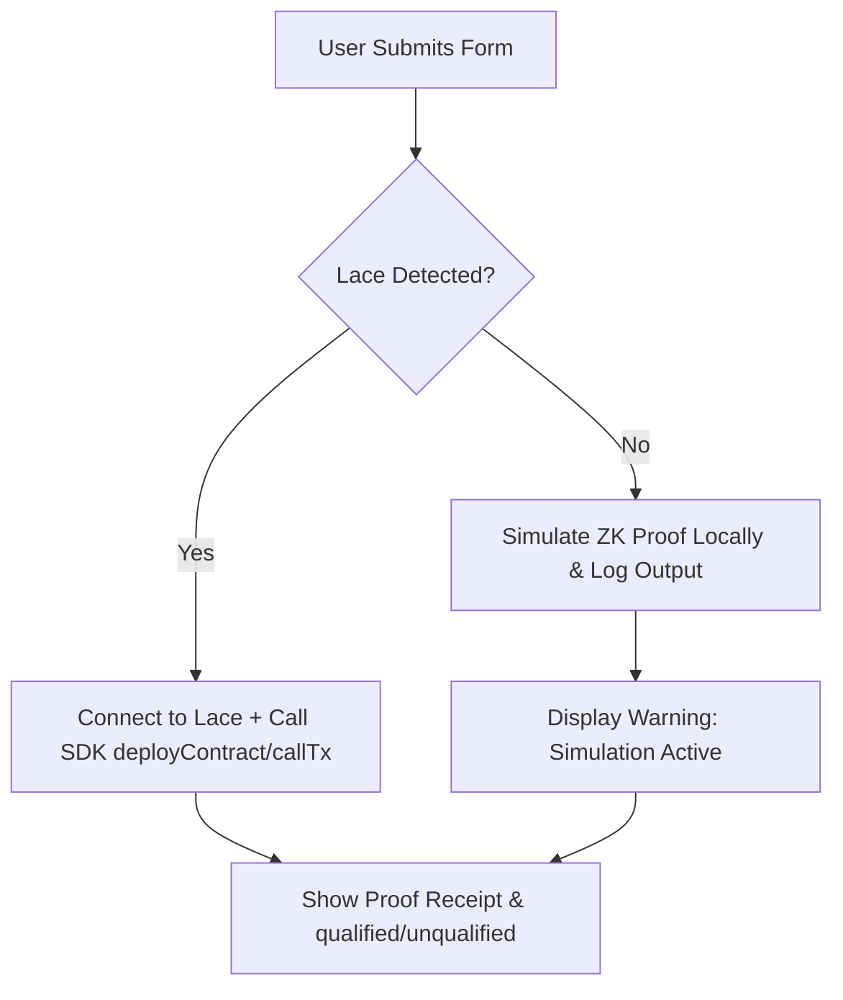

# 🛡️ ShieldHire — Production Deployment & Setup Guide

This comprehensive guide details how to configure, compile, deploy, and interact with the **ShieldHire** zero-knowledge dApp on both the **Midnight Preprod Testnet** and the **Local Docker Devnet**.

---

## 🔌 1. Lace Wallet & Testnet Setup (Preprod)

To interact with ShieldHire on the public Midnight Testnet, users and judges must configure a compatible web wallet:

### Step A: Install the Lace Wallet Extension
1. Install the official browser extension (available for Chrome/Chromium browsers).
2. Create a new wallet and securely back up your secret recovery phrase.

### Step B: Switch to the Midnight Preprod Network
1. Open the Lace Wallet extension.
2. Navigate to **Settings** (gear icon) -> **Network**.
3. Select **Midnight Preprod** (instead of Mainnet/Devnet).

### Step C: Claim Testnet Tokens (tDUSK Faucet)
To pay for transaction fees and smart contract deployments:
1. Copy your Midnight wallet address from Lace.
2. Visit the official [Midnight Preprod Faucet](https://faucet.preprod.midnight.network/).
3. Paste your address, solve the captcha, and request **tDUSK** tokens. They will arrive in your wallet within a few minutes.

---

## 🐳 2. Local Docker Devnet Sandbox

If you prefer to run a private, isolated Midnight network locally on your machine:

### Step A: Prerequisites
Ensure you have the following installed:
*   [Docker Desktop](https://www.docker.com/products/docker-desktop/) (running)
*   [Node.js](https://nodejs.org/) (v18+)
*   [Yarn](https://yarnpkg.com/)

### Step B: Spin Up the Devnet Sandbox
1. Clone the official [Midnight Local Devnet](https://github.com/midnight-ntwrk/midnight-local-dev) repository.
2. In your terminal, navigate to the cloned local devnet directory.
3. Spin up the network nodes (including the ledger, indexer, and local proof server) using Docker:
   ```bash
   yarn env:up
   ```
4. Confirm all containers are running successfully in your Docker Desktop dashboard.

---

## ⚡ 3. Environment & Network Switching

ShieldHire is built to easily switch between the local Docker Devnet and the public Preprod Testnet.

### Switch Configuration in Code
Open `src/contract-layer/contract-api.ts`. The SDK connection configuration is managed dynamically by the `ShieldHireContractAPI` singleton constructor:

```typescript
// To switch networks, swap out the config parameter:
class ShieldHireContractAPI {
  private constructor() {
    // CURRENT CONFIGURATION:
    // Switch to PREPROD_CONFIG for the public Testnet, or LOCAL_CONFIG for local devnet
    this.config = PREPROD_CONFIG; 
    
    console.log(`[ShieldHire] Initialized on network: ${this.config.networkName}`);
  }
}
```

> [!NOTE]
> *   **`LOCAL_CONFIG`** targets `http://localhost:9933` (Docker ledger) and a local proof server.
> *   **`PREPROD_CONFIG`** targets the official Midnight Preprod blockchain endpoints.

---

## 🛠️ 4. Compiling Smart Contracts (`.compact` -> TypeScript)

The core ZK-SNARK logic of ShieldHire is defined in `contract/shieldhire.compact`. 

To compile this contract and generate the auto-typed TypeScript bindings and ZK circuits:

```bash
# Compile and generate bindings inside src/generated/shieldhire/
npx compact-compile contract/shieldhire.compact src/generated/shieldhire/
```

This creates:
*   `index.ts`: The TypeScript wrapper for the smart contract's state and transitions.
*   `circuit.wasm` / `circuit.pk` / `circuit.vk`: The ZK-SNARK cryptographic circuit keys used by the Proof Server to generate zero-knowledge proofs on the candidate's device.

---

## 🛡️ 5. Resilient ZK Fallback Architecture (Demo Mode)

During live judging or hackathon reviews, the public Midnight network, proof servers, or wallet extensions might experience high latency, rate-limiting, or downtime. 

To guarantee a **flawless, crash-proof judging experience**, ShieldHire implements a **Simulation Fallback Mechanism**:



### What to expect if Lace is not installed/configured:
1. **Zero Client Crashes:** Instead of throwing unhandled promise rejections, the application gracefully logs the warning in the console:
   `[ShieldHire] DApp Connector not detected. Safely falling back to local cryptographic simulation.`
2. **Local ZK Witness Computation:** The candidate form computes the qualification criteria locally using the exact identical parameters as the `.compact` circuit.
3. **Receipt Generation:** The UI will still animate the 5 pipeline stages, generate pseudo-random transaction hashes, and display the detailed **Proof Inspector Panel** as if the transaction went on-chain.
4. **Console Output:** Open your browser's Developer Tools (F12) to inspect the simulated zero-knowledge inputs, secret witnesses, public inputs, and empty arrays confirming that no private data left the candidate's device!
