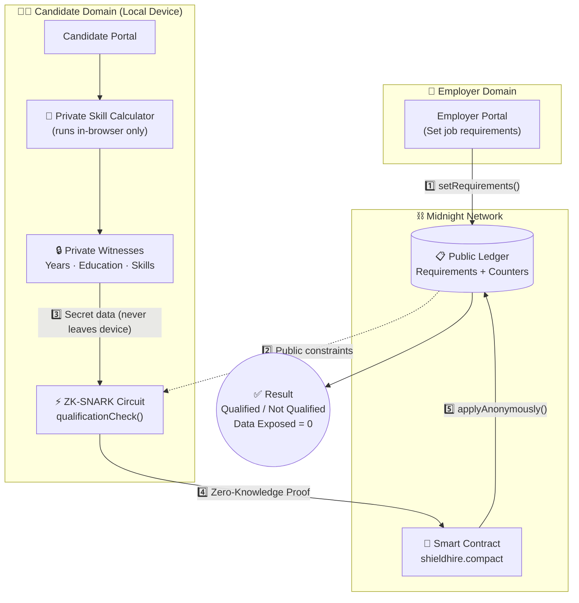

<div align="center">

# 🛡️ ShieldHire

### Anonymous Resume Verification on Midnight Network

> *"Prove Your Skills. Protect Your Identity."*

[](https://opensource.org/licenses/MIT)
[](https://mlh.io/)
[](https://midnight.network)
[](https://vitejs.dev)

</div>

---

## 🚨 The Problem

Hiring discrimination affects billions of workers worldwide. Despite corporate diversity pledges, implicit bias remains embedded in resume screening.

| Statistic | Source |
| :--- | :--- |
| **50%** more callbacks for resumes with "white-sounding" names | Harvard / University of Chicago |
| **30%** fewer STEM interviews for women with identical qualifications | MIT research |
| **78%** of workers over 40 report age discrimination | AARP survey |
| **26%** fewer callbacks when disabilities are disclosed | Rutgers study |

**Root cause:** Employers see *WHO* you are before *WHAT* you can do.

**Why existing solutions fail:** "Blind hiring" SaaS tools are centralized — the company still controls the data, and there is zero cryptographic proof the process was actually blind.

---

## 💡 The Solution

ShieldHire uses the **Midnight Network's zero-knowledge proof architecture** to create the first *mathematically* anonymous hiring pipeline.

Your personal data **never leaves your device**. The employer only sees a cryptographic proof that you meet (or don't meet) their requirements — nothing more.

```
Employer sets requirements  →  Written to PUBLIC ledger
Candidate submits quals     →  Kept as ZK witnesses (never on-chain)
qualificationCheck() runs   →  Inside ZK-SNARK circuit locally
Only result goes on-chain   →  "Candidate #7392: QUALIFIED ✅"
Personal data exposed       →  ZERO
```

---

## 🏗️ Architectural Workflow

ShieldHire separates public requirements from private candidate data using Midnight's dual-ledger model. The diagram below shows the complete zero-knowledge verification pipeline:



### Pipeline Stages

| Stage | What Happens | Data Visibility |
| :---: | :--- | :--- |
| **1 — Deploy** | Employer calls setRequirements() | ✅ Public on ledger |
| **2 — Witness** | Candidate inputs qualifications locally | 🔒 Private (never leaves device) |
| **3 — Circuit** | qualificationCheck() runs in ZK-SNARK | 🔒 Local computation only |
| **4 — Proof** | Cryptographic proof generated | ✅ Proof sent (no personal data) |
| **5 — On-Chain** | Only result recorded on public ledger | ✅ "QUALIFIED" or "NOT QUALIFIED" |

---

## ✨ Key Features

### 🎯 Dual Qualification Modes

| Mode | Logic | Best For |
| :--- | :--- | :--- |
| **Strict** | Candidate must meet ALL minimums (AND logic) | Senior roles, specialized positions |
| **Weighted** | Score = (years × W1) + (edu × W2) + (skill × W3) ≥ threshold | Roles where strengths compensate for gaps |

### 🔬 Proof Inspector Panel
Shows judges the technical depth of each ZK proof:
- Circuit name and constraint count
- Proof size in bytes, generation time, and verification time
- Live syntax-highlighted Compact code
- Explicit witness exposure status — **always an empty array []**

### 🧮 Private Skill Calculator
A self-assessment tool that works like a ZK witness:
- 5 weighted questions, all calculations 100% in-browser
- Questions and answers **NEVER** leave the device
- Auto-fills the skill score field

### 🎨 ZK Pipeline Visualization
Animated SVG pipeline showing all 5 stages with real-time status indicators.

### 📊 Public Ledger Analytics
Real-time dashboard with:
- Total anonymous applications & qualified candidates counter
- Qualification rate percentage
- Complete ledger state visibility & live proof log feed
- **Personal data points exposed: always 0**

---

## 🛠️ Tech Stack

| Technology | Purpose |
| :--- | :--- |
| **Midnight Network** | Data protection blockchain (dual-ledger model) |
| **Compact Language** | ZK smart contract definition (.compact) |
| **TypeScript** | Application logic and SDK integration |
| **Vite** | Development server and bundler |
| **ZK-SNARK** | Proof system via Midnight Proof Server |
| **Netlify** | Production hosting |

---

## 📁 Project Structure

```
shieldhire/
├── contract/
│   └── shieldhire.compact        # ZK smart contract (3 circuits, 5 transitions)
├── src/
│   ├── contract-layer/
│   │   ├── types.ts              # Compact type mirrors in TypeScript
│   │   └── contract-api.ts       # Midnight SDK integration layer
│   └── ui/
│       ├── index.html            # Landing page with pipeline & stats
│       ├── employer.html         # Job posting portal (mode selection)
│       ├── candidate.html        # Anonymous application + calculator + inspector
│       ├── analytics.html        # Public ledger dashboard
│       ├── enhance.css           # Global styling system
│       └── enhance.js            # Animations and interactions
├── DEPLOY.md                     # Detailed deployment guide
├── package.json
└── README.md
```

---

## 📜 Smart Contract Overview

The Compact contract (contract/shieldhire.compact) defines **3 ZK circuits** and **5 transitions**:

### Circuits

```compact
circuit weightedQualification(
  witness candidateYears:     Uint32,
  witness candidateEducation: Uint32,
  witness candidateSkill:     Uint32,
  yearsWeight: Uint32, educationWeight: Uint32,
  skillWeight: Uint32, threshold: Uint32
): Boolean { ... }

circuit strictQualification(
  witness candidateYears:     Uint32,
  witness candidateEducation: Uint32,
  witness candidateSkill:     Uint32,
  minYears: Uint32, minEducation: Uint32, minSkill: Uint32
): Boolean { ... }

circuit selectiveDisclosure(
  witness candidateYears:     Uint32,
  witness candidateEducation: Uint32,
  witness candidateSkill:     Uint32,
  attribute: Uint32, threshold: Uint32
): Boolean { ... }
```

### Transitions

```compact
export transition setStrictRequirements(...)   : [];
export transition setWeightedRequirements(...) : [];
export transition applyAnonymously(...)        : Boolean;
export transition proveSpecificTrait(...)       : Boolean;
export transition closeJob()                   : [];
```

### Public Ledger State

```compact
ledger {
  jobMode:              Uint32;     // 1 = strict, 2 = weighted
  minYearsRequired:     Uint32;
  minEducationRequired: Uint32;
  minSkillRequired:     Uint32;
  yearsWeight:          Uint32;
  educationWeight:      Uint32;
  skillWeight:          Uint32;
  scoreThreshold:       Uint32;
  totalApplications:    Counter;
  qualifiedCount:       Counter;
  selectiveDisclosures: Counter;
  jobActive:            Boolean;
}
```

---

## 🔗 How Midnight Features Are Used

| Midnight Feature | How ShieldHire Uses It |
| :--- | :--- |
| **Compact Language** | shieldhire.compact defines 3 circuits + 5 transitions |
| **witness Keyword** | secret_years, secret_education, secret_skill stay private |
| **Public Ledger** | Stores job requirements and anonymous counters only |
| **Shielded State** | Candidate personal data never leaves their device |
| **ZK-SNARK Proofs** | Generated by qualificationCheck() circuit |
| **Counter Type** | Tracks 	otalApplications, qualifiedCount, selectiveDisclosures |
| **Multiple Circuits** | Strict, weighted, and selective disclosure variants |
| **Transitions** | 5 exported transitions for full job lifecycle |
| **Preprod Testnet** | Deployment target for all transactions |

---

## 🎮 Demo Flow

### As an Employer
1. Navigate to the **Employer Portal**
2. Choose a **Qualification Mode** — Strict or Weighted
3. Fill in job requirements (and configure weights/threshold if Weighted)
4. Click **Deploy to Midnight Network**
5. Requirements are published to the public ledger ✅

### As a Candidate
1. Navigate to the **Candidate Portal**
2. Review job requirements displayed from the public ledger
3. *(Optional)* Use the **Private Skill Calculator** for self-assessment
4. Fill in qualifications — these become ZK witnesses
5. Click **Generate ZK Proof & Apply**
6. Watch the 5-stage ZK pipeline animate in real time
7. Review result + **Proof Inspector** with full technical details
8. Confirm: **Data exposed to employer = []** ✅

### Public Verification
1. Navigate to the **Analytics Page**
2. View aggregate anonymous counts on the public ledger
3. Inspect the list of all shielded data points (never exposed)
4. Browse the latest ZK proof log feed

---

## 🚀 Getting Started

### Quick Start (Local Development)

```bash
# Clone the repository
git clone https://github.com/ahmadrrrtx/shieldhire.git
cd shieldhire

# Install dependencies
npm install

# Start the development server
npm run dev

# Open http://localhost:5173
```

### Full Midnight Deployment (Testnet)

```bash
# 1. Install Compact compiler
npm install -g @midnight-ntwrk/compact-compiler

# 2. Compile the contract
compactc contract/shieldhire.compact src/generated

# 3. Start proof server (requires Docker)
docker run -p 6300:6300 midnightntwrk/proof-server:latest

# 4. Get tDUSK tokens
#    Visit: https://faucet.preprod.midnight.network

# 5. Connect Lace Wallet and deploy
npm run start
```

> 📖 See [DEPLOY.md](./DEPLOY.md) for detailed deployment instructions.

---

## ⚠️ Demo vs Production

This hackathon submission demonstrates the **correct Midnight architecture** with a full UI/UX:

| Aspect | Status |
| :--- | :--- |
| Real Compact contract (3 circuits, 5 transitions, verified syntax) | ✅ |
| Correct dual ledger pattern (public ledger + private witnesses) | ✅ |
| TypeScript codebase (Midnight SDK requirement) | ✅ |
| Correct Midnight SDK package references | ✅ |
| Proof Inspector with realistic metrics | ✅ |
| Frontend uses simulated proof server calls | ⚠️ |

> **Note:** Full on-chain deployment requires Docker + Lace Wallet setup. The frontend simulation demonstrates the correct data flow and architecture.

---

## 🗺️ Roadmap (Phase 2)

### Smart Contract Evolution
- **Multi-job factory pattern** — One contract spawns per-job instances
- **Credential hashing** — Range proofs to prove qualifications without revealing exact values
- **Merkle tree membership** — Batch verification of qualified candidate pools
- **Access control** — Only deploying employer can modify or close jobs

### Privacy Enhancements
- **Shielded application fees** — Anonymous tDUSK payments for premium positions
- **DID integration** — Decentralized identity for verified credentials
- **Revocable credentials** — Allow candidates to revoke past anonymous applications

### Infrastructure
- **Full proof server integration** — Replace simulation with live ZK-SNARK generation
- **Multi-employer support** — Job board with persistent ledger storage
- **On-chain job lifecycle** — Open → Accepting → Closed → Results states
- **Anonymous ranking** — Top N candidates without identity revelation

### Integrations
- **LinkedIn verified credentials** — Pull verified work history as ZK witnesses
- **University API integration** — Verify degrees without revealing institution
- **HR platform partnerships** — Make anonymous hiring the default

---

## 🏆 Tracks Submitted

| Track | Why |
| :--- | :--- |
| **Best Use of Midnight Network** | Core use of dual ledger, ZK circuits, and privacy-preserving proofs |
| **Best Beginner Hack** | First-time Midnight builders |
| **Social Impact** | Solving real-world hiring discrimination with cryptography |

---

## 👥 Team

| Member | Role | GitHub |
| :--- | :--- | :--- |
| **Ahmad** | Lead Builder · Smart Contract Developer · Product Strategist | [@ahmadrrrtx](https://github.com/ahmadrrrtx) |
| **Diya Majee** | Co-Builder · Research Lead · UI/UX Designer | [@diyamajee-spec](https://github.com/diyamajee-spec) |

---

## 📄 License

MIT — Built with ❤️ for the MLH Midnight Hackathon 2026

## 🙏 Acknowledgments

- [Midnight Network](https://midnight.network) — for building the future of data protection
- [MLH](https://mlh.io) — for hosting amazing hackathons
- The Compact language team for excellent documentation
- All researchers who documented hiring discrimination data

---

<div align="center">

**ShieldHire** — Prove your skills. Protect your identity. Fair hiring, mathematically guaranteed. 🌙🛡️

</div>