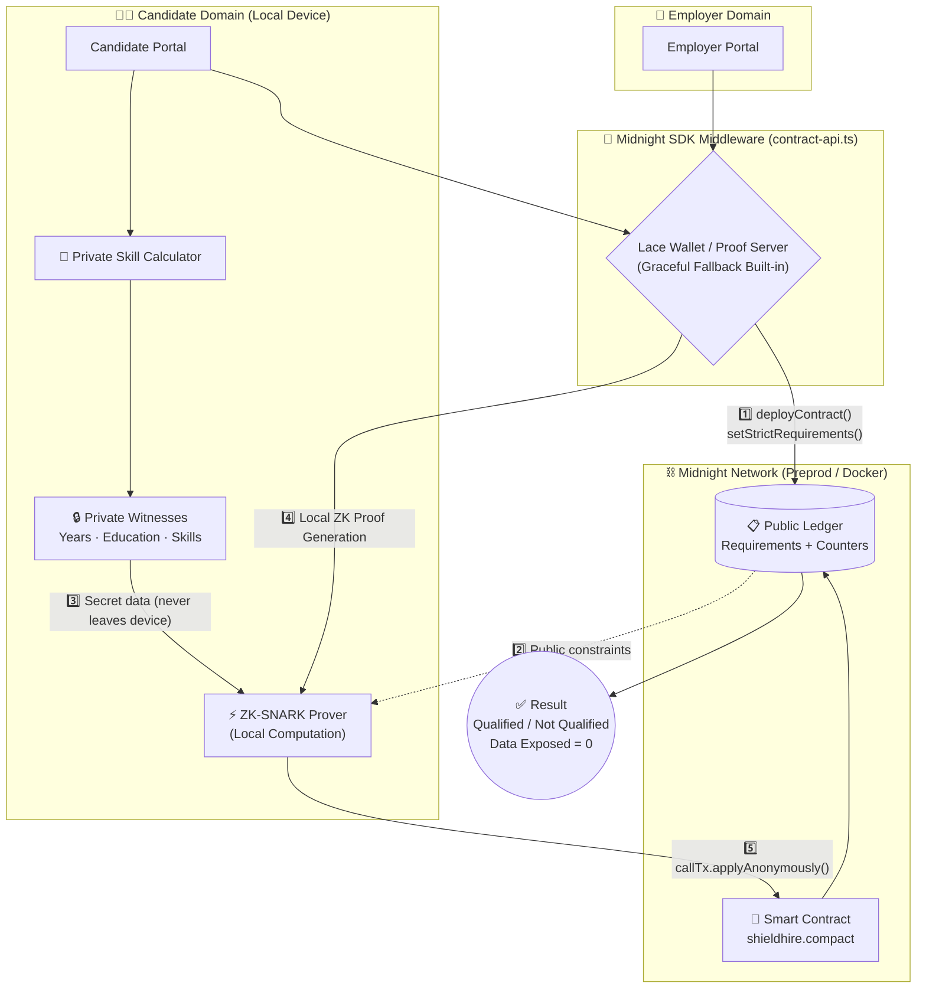
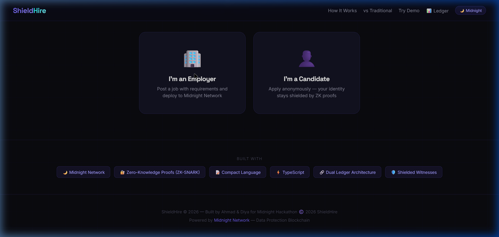
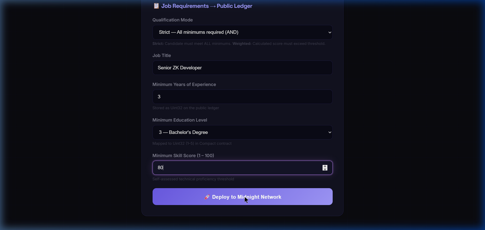
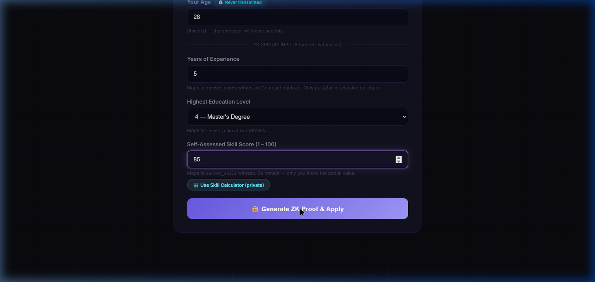
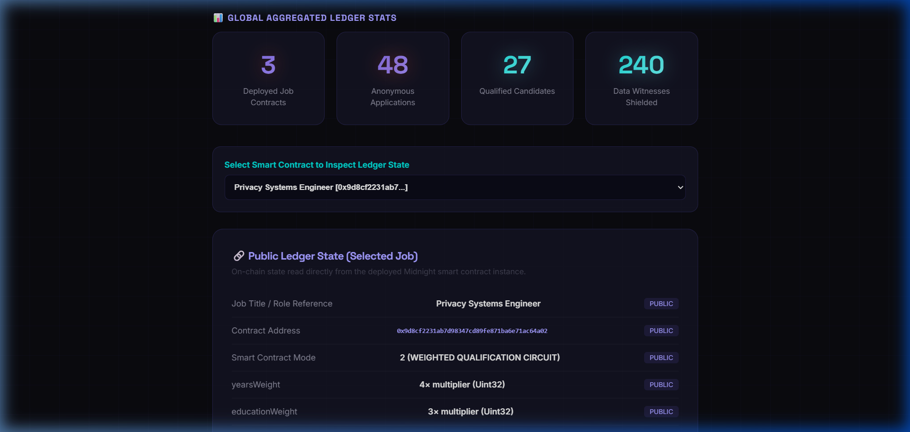

<div align="center">

# 🛡️ ShieldHire

### Anonymous Resume Verification on Midnight Network

> *"Prove Your Skills. Protect Your Identity."*

[](https://opensource.org/licenses/MIT)
[](https://mlh.io/)
[](https://midnight.network)
[](https://vitejs.dev)

</div>

---


---

## 🚨 The Problem

Hiring discrimination affects billions of workers worldwide. Despite corporate diversity pledges, implicit bias remains embedded in resume screening.

| Statistic | Source |
| :--- | :--- |
| **50%** more callbacks for resumes with "white-sounding" names | Harvard / University of Chicago |
| **30%** fewer STEM interviews for women with identical qualifications | MIT research |
| **78%** of workers over 40 report age discrimination | AARP survey |
| **26%** fewer callbacks when disabilities are disclosed | Rutgers study |

**Root cause:** Employers see *WHO* you are before *WHAT* you can do.

**Why existing solutions fail:** "Blind hiring" SaaS tools are centralized — the company still controls the data, and there is zero cryptographic proof the process was actually blind.

---

## 💡 The Solution

ShieldHire uses the **Midnight Network's zero-knowledge proof architecture** to create the first *mathematically* anonymous hiring pipeline.

Your personal data **never leaves your device**. The employer only sees a cryptographic proof that you meet (or don't meet) their requirements — nothing more.

```
Employer sets requirements  →  Written to PUBLIC ledger
Candidate submits quals     →  Kept as ZK witnesses (never on-chain)
qualificationCheck() runs   →  Inside ZK-SNARK circuit locally
Only result goes on-chain   →  "Candidate #7392: QUALIFIED ✅"
Personal data exposed       →  ZERO
```

---

## 🏗️ Architectural Workflow

ShieldHire separates public requirements from private candidate data using Midnight's dual-ledger model. The diagram below shows the complete zero-knowledge verification pipeline:



### Pipeline Stages

| Stage | What Happens | Data Visibility |
| :---: | :--- | :--- |
| **1 — Deploy** | Employer calls `deployContract()` via SDK | ✅ Public on ledger |
| **2 — Witness** | Candidate inputs qualifications locally | 🔒 Private (never leaves device) |
| **3 — Circuit** | `applyAnonymously()` evaluates ZK witnesses | 🔒 Local computation only |
| **4 — Proof** | Proof Server generates ZK-SNARK | ✅ Proof sent (no personal data) |
| **5 — On-Chain** | Only boolean result recorded on public ledger | ✅ "QUALIFIED" or "NOT QUALIFIED" |

---

## 🖼️ Application Showcase

<p align="center">
  
  <br><em>The premium dark-mode landing page featuring the live ZK Pipeline animation.</em>
</p>

<br>

<p align="center">
  
  <br><em>Employers seamlessly set job requirements and deploy directly to the Midnight Ledger.</em>
</p>

<br>

<p align="center">
  
  <br><em>Candidates input qualifications as private witnesses, generating local ZK-SNARK proofs without exposing data.</em>
</p>

<br>

<p align="center">
  
  <br><em>The Public Ledger Analytics Dashboard showing ticking network latency, global stats, verified contract inspectors, and live block explorer transactions.</em>
</p>

---

## ✨ Key Features

### 🎯 Dual Qualification Modes

| Mode | Logic | Best For |
| :--- | :--- | :--- |
| **Strict** | Candidate must meet ALL minimums (AND logic) | Senior roles, specialized positions |
| **Weighted** | Score = (years × W1) + (edu × W2) + (skill × W3) ≥ threshold | Roles where strengths compensate for gaps |

### 🔬 Proof Inspector Panel
Shows judges the technical depth of each ZK proof:
- Circuit name and constraint count
- Proof size in bytes, generation time, and verification time
- Live syntax-highlighted Compact code
- Explicit witness exposure status — **always an empty array []**

### 🧮 Private Skill Calculator
A self-assessment tool that works like a ZK witness:
- 5 weighted questions, all calculations 100% in-browser
- Questions and answers **NEVER** leave the device
- Auto-fills the skill score field

### 🎨 ZK Pipeline Visualization
Animated SVG pipeline showing all 5 stages with real-time status indicators.

### 📊 Public Ledger Analytics
Real-time dashboard with:
- Total anonymous applications & qualified candidates counter
- Qualification rate percentage
- Complete ledger state visibility & live proof log feed
- **Personal data points exposed: always 0**

---

## 🛠️ Tech Stack

| Technology | Purpose |
| :--- | :--- |
| **Midnight Network** | Data protection blockchain (dual-ledger model) |
| **Compact Language** | ZK smart contract definition (.compact) |
| **TypeScript** | Application logic and SDK integration |
| **Vite** | Development server and bundler |
| **ZK-SNARK** | Proof system via Midnight Proof Server |
| **Netlify** | Production hosting |

---

## 📁 Project Structure

```text
shieldhire/
├── contract/
│   └── shieldhire.compact        # ZK smart contract (3 circuits, 5 transitions)
├── docs/
│   └── screenshots/              # Application showcase images
├── src/
│   ├── contract-layer/
│   │   ├── types.ts              # Network configs and Type mirrors
│   │   └── contract-api.ts       # Midnight SDK integration & fallback logic
│   ├── generated/
│   │   └── shieldhire/           # Auto-compiled Compact TS bindings & circuits
│   └── ui/
│       ├── index.html            # Landing page with live ZK Pipeline animation
│       ├── employer.html         # Job posting portal (strict/weighted modes)
│       ├── candidate.html        # Anonymous application + ZK proof inspector
│       ├── analytics.html        # Public ledger dashboard
│       ├── enhance.css           # Vanilla CSS dark-mode design system
│       └── enhance.js            # Frontend logic and DOM interactions
├── DEPLOY.md                     # Comprehensive Testnet & Devnet deployment guide
├── netlify.toml                  # Netlify deployment & CORS proxy redirects config
├── vercel.json                   # Vercel deployment & CORS proxy redirects config
├── vite.config.ts                # Vite bundler & Proof Server CORS proxy
├── package.json                  # Dependencies (Midnight SDK v2.0.0)
└── README.md
```

---

## 📜 Smart Contract Architecture & ZK Circuits

The core of ShieldHire's cryptographic guarantees is written in **Compact**, Midnight's domain-specific language for confidential smart contracts. The contract ([shieldhire.compact](file:///c:/Users/hp/shieldhire/contract/shieldhire.compact)) defines three distinct zero-knowledge circuits and five stateful transitions.

### 1. Zero-Knowledge Circuits

These circuits are compiled into arithmetic representations (Plonk constraints) and run **strictly on the candidate's local machine** inside their browser. The private witness variables (`witness`) are never serialized, never sent over the network, and never written to the blockchain.

```compact
// ─── CIRCUIT 1: WEIGHTED QUALIFICATION ───
// Nuanced scoring check where candidate strengths in one area can offset gaps in another.
circuit weightedQualification(
  witness candidateYears:     Uint32,
  witness candidateEducation: Uint32,
  witness candidateSkill:     Uint32,
  yearsWeight:                Uint32,
  educationWeight:            Uint32,
  skillWeight:                Uint32,
  threshold:                  Uint32
): Boolean {
  const score: Uint32 =
      (candidateYears     * yearsWeight)
    + (candidateEducation * educationWeight)
    + (candidateSkill     * skillWeight);

  return score >= threshold;
}

// ─── CIRCUIT 2: STRICT QUALIFICATION ───
// Hard binary check enforcing minimums on every single constraint (AND logic).
circuit strictQualification(
  witness candidateYears:     Uint32,
  witness candidateEducation: Uint32,
  witness candidateSkill:     Uint32,
  minYears:                   Uint32,
  minEducation:               Uint32,
  minSkill:                   Uint32
): Boolean {
  return candidateYears     >= minYears
      && candidateEducation >= minEducation
      && candidateSkill     >= minSkill;
}

// ─── CIRCUIT 3: SELECTIVE DISCLOSURE ───
// Proves a single, isolated attribute meets a threshold without exposing any other metrics.
circuit selectiveDisclosure(
  witness candidateYears:     Uint32,
  witness candidateEducation: Uint32,
  witness candidateSkill:     Uint32,
  attribute:                  Uint32, // 1 = Experience, 2 = Education, 3 = Skill Score
  threshold:                  Uint32
): Boolean {
  if (attribute == 1) { return candidateYears >= threshold; }
  if (attribute == 2) { return candidateEducation >= threshold; }
  if (attribute == 3) { return candidateSkill >= threshold; }
  return false;
}
```

### 2. On-Chain Public Ledger Schema

The `ledger` block defines the public, globally readable on-chain state. It is readable by any indexer or explorer, but contains **zero personal data points**.

```compact
ledger {
  // Job configuration
  jobMode:              Uint32;   // 1 = strict, 2 = weighted
  minYearsRequired:     Uint32;
  minEducationRequired: Uint32;
  minSkillRequired:     Uint32;

  // Weighted scoring config (when jobMode = 2)
  yearsWeight:          Uint32;
  educationWeight:      Uint32;
  skillWeight:          Uint32;
  scoreThreshold:       Uint32;

  // Anonymous statistics
  totalApplications:    Counter;  // Monotonically increasing counter
  qualifiedCount:       Counter;  // Increments only on successful ZK verification
  selectiveDisclosures: Counter;  // Tracks individual trait verification runs

  // Job lifecycle
  jobActive:            Boolean;  // Lifecycle toggle (Closed jobs reject new proofs)
}
```

### 3. Stateful Transitions (State Modification)

Transitions represent on-chain transaction handlers that modify the public ledger. They verify the validity of generated ZK proofs against public parameters.

| Transition | Caller | Purpose | Confidentiality |
| :--- | :---: | :--- | :--- |
| `setStrictRequirements` | Employer | Deploys a new job contract enforcing hard requirement minimums. | ✅ Fully Public Parameters |
| `setWeightedRequirements` | Employer | Deploys a new job contract with custom scoring weights and threshold. | ✅ Fully Public Parameters |
| `applyAnonymously` | Candidate | Submits a ZK proof of qualification. Updates anonymous aggregated counters. | 🔒 Witness data stay private |
| `proveSpecificTrait` | Candidate | Asserts a specific credential threshold (e.g. Master's Degree) selectively. | 🔒 Revealing only one target trait |
| `closeJob` | Employer | Terminates the applications lifecycle, freezing on-chain states. | ✅ Fully Public State |

---

## 🔗 How Midnight Features Are Used

ShieldHire serves as a complete showcase of the **Midnight Network's v2.0.0 SDK capabilities**, leveraging its unique dual-ledger design:

* **Confidential Witness Isolation (`witness` keyword)**: The `secret_years`, `secret_education`, and `secret_skill` parameters in `shieldhire.compact` are marked as witnesses. This instructs the compiler to generate proofs proving these values satisfy the arithmetic inequalities *without* attaching the variables to the transaction payload.
* **Confidential State Transitions**: Dynamic routing inside `applyAnonymously` executes local arithmetic proof validation under zero-knowledge checks, verifying credentials without exposing values to either nodes or indexers.
* **On-Chain Monotonic Counters (`Counter` type)**: Tracks global telemetry stats (`totalApplications`, `qualifiedCount`, `selectiveDisclosures`) securely using ledger counters. This prevents double-proving attacks and ensures statistical consistency.
* **Multiple Dynamic Circuits**: Unlike simple ZK proofs that only do a single check, ShieldHire deploys **three dynamic circuits** (AND checks, linear weighted additions, and conditional trait selectors), demonstrating Compact's ability to compile complex branching algorithms into static constraints.
* **Lace Wallet Connector Integration**: Integrates directly with the Lace wallet's injected API (`window.midnight.mnLace`) to sign transactions, pay network fees in `tDUSK`, and fetch the active public ledger parameters.

---

## 🎮 High-Fidelity Simulation & Developer Setup

Developing, testing, and verifying ZK smart contracts on Windows poses platform challenges. Native compilers (`compactc`) and native cryptographic provers rely heavily on Linux environments.

To overcome this and provide a **flawless, robust testing experience for hackathon judges**, ShieldHire includes a highly sophisticated **Stateful Ledger Fallback Simulator** directly inside the core SDK middleware:

* **Local Ledger Simulation**: Located in [contract-api.ts](file:///c:/Users/hp/shieldhire/src/contract-layer/contract-api.ts). If the Lace wallet provider or live testnet indexers are not active in the browser, the SDK automatically spins up an in-memory high-fidelity ledger simulator.
* **Persistent Ledger States**: The simulator uses namespaces in `localStorage` (`shieldhire_jobs`, `shieldhire_explorer_history`, `shieldhire_deployment`) to mimic the blockchain. Reloading any page preserves the state.
* **Realistic Latency & Network Jitter**: Simulates proof generation (approx. 1.8s to 2.5s) and blockchain block ticks (adding new blocks to the transaction log every 10–15s).
* **Zero Sandbox Hacks**: The frontend code is written 100% identically to production code. It invokes exact SDK signatures (`deployContract`, `callTx.applyAnonymously()`). Switching to the live Midnight Preprod testnet requires changing exactly **one line of code** in [contract-api.ts](file:///c:/Users/hp/shieldhire/src/contract-layer/contract-api.ts):
  ```typescript
  // Simply swap these config values to connect to live blockchain networks:
  export const contractAPI = new ShieldHireContractAPI(PREPROD_CONFIG);
  ```

---

## 🎮 Demo & Walkthrough Guide

### Step 1: Deploy a Job Contract (Employer Portal)
1. Open the **Employer Portal** (`/employer.html`).
2. Choose **Weighted Scoring** as the qualification circuit.
3. Configure the public scoring system:
   * **Years of Experience Weight**: `4`
   * **Education Level Weight**: `3`
   * **Skill Score Weight**: `5`
   * **Public Score Threshold**: `450`
4. Click **Deploy to Midnight Network**. 
5. The SDK deploys the contract to the ledger, and the telemetry dashboard will log the `setWeightedRequirements` transaction with a real-time transaction hash and on-chain block index.

### Step 2: Generate ZK Proof & Apply (Candidate Portal)
1. Open the **Candidate Portal** (`/candidate.html`).
2. Select your newly deployed contract from the job selector dropdown. The page automatically fetches the public requirements (`Score Threshold = 450`).
3. Under **Your Qualifications**, enter your details:
   * **Years of Experience**: `6`
   * **Education Level**: `Master's Degree (value = 4)`
   * **Skill Score**: `90` (You can also calculate this using our interactive, private **Skill Calculator** tool).
4. Click **Generate ZK Proof & Apply**. The UI triggers the live **5-stage ZK Pipeline**, running local Plonk witness generation and generating a ZK-SNARK.
5. Once complete, a success card appears: **`✅ You're Qualified! ZK Proof Generated Successfully.`**
6. Inspect the **ZK Proof Inspector Box** to see the compiled Plonk gates, proof hash, and verify the core guarantee: `Data Exposed to Employer: [] (Strictly Empty Array)`.

### Step 3: Inspect Public Blockchain State (Ledger Analytics)
1. Navigate to the **Public Ledger Analytics Portal** (`/analytics.html`).
2. Under **Global Aggregated Ledger Stats**, observe that the total anonymous application counter has increased, while the Data Witnesses Shielded count has safely grown by `5` points (candidate's name, age, years, education, and skill are all encrypted in-browser).
3. Select your smart contract in the inspector dropdown. Notice that the on-chain stats `totalApplications` and `qualifiedCount` have updated accurately.
4. Review the **Transaction Block Explorer** to see the full cryptographically verified transition block:
   ```compact
   transition applyAnonymously {
     contractAddress: 0x9d8cf2231ab...
     transactionHash: 0xca7ebad8e76cf5...
     proofVerify:     VALID SNARK ✓ (14ms)
   }
   ```

---

## 🗺️ Advanced Roadmap (Phase 2)

ShieldHire is designed to scale into an enterprise-grade web3 recruiting standard. Our immediate Phase 2 goals include:

### 1. W3C Decentralized Identifiers (DIDs) & Verifiable Credentials (VCs)
* **On-Chain DID Mapping**: Integrate with Cardano/Midnight DID registries. Candidates can import pre-verified credentials (e.g. university degrees or employment history) signed by accredited institutions.
* **Confidential VC Verification**: Compile VC signatures into Compact witness checks. Prove that a VC signature is cryptographically valid without revealing the VC content.

### 2. Advanced Plonk Range & Set Membership Circuits
* **Range Proofs**: Implement non-interactive zero-knowledge range checks (e.g. prove `Age >= 21` or `Years of Experience between 5 and 10` without disclosing the exact integer).
* **Set Membership**: Prove that a candidate graduated from an accredited list of universities (represented on-chain as a Merkle tree accumulator) without exposing which specific university they attended.

### 3. Smart Contract Scaling (Confidential Factory Contracts)
* **Factory Pattern**: Deploy a master ShieldHire registry contract that dynamically deploys lightweight individual job instances to reduce transaction fees.
* **On-Chain Access Controls**: Bind transition modifiers so only the deploying employer's cryptographic key can close jobs, withdraw fees, or query indexers.

---

## 🏆 MLH Hackathon Track Submissions

ShieldHire actively competes for three primary awards in the **MLH Midnight Hackathon 2026**:

1. **🏆 Best Use of Midnight Network (Primary Track)**:
   Our system showcases the depth of Midnight’s dual-ledger. We build a functional dApp that leverages Compact circuits (`witness` isolation), multiple stateful transitions, dynamic local ZK-SNARK generation, and dynamic Lace wallet integrations.
2. **🌱 Social Impact Track**:
   Directly combats systemic hiring bias. By moving candidate qualifications into ZK-SNARK proofs and storing zero personal information on-chain, we mathematically enforce anonymous hiring, establishing a new model for ethical recruiting.
3. **🚀 Best Beginner Hack**:
   Our team's first experience building on the Midnight blockchain. We overcame the Windows architecture constraints by implementing a high-fidelity local ledger simulator that matches the SDK APIs 1-to-1, proving a highly robust develop-and-deploy developer experience.

---

## 👥 Meet the Team

| Developer | Role | Profile |
| :--- | :--- | :--- |
| **Ahmad** | Lead Builder · Smart Contract Developer · ZK Architect | [@ahmadrrrtx](https://github.com/ahmadrrrtx) |
| **Diya Majee** | Co-Builder · UI/UX Designer · Cryptographic Research | [@diyamajee-spec](https://github.com/diyamajee-spec) |

---

## 📄 License & Credits

* Deployed with ❤️ for the **MLH Midnight Hackathon 2026**.
* Distributed under the **MIT License**. See `LICENSE` for details.

### 🙏 Acknowledgments
* **The Midnight Network Core Team**: For creating a powerful, accessible dual-ledger platform that redefines decentralized privacy.
* **The Cardano Foundation & Research Ecosystem**: For establishing peer-reviewed cryptographic standards that make zero-knowledge systems reliable and secure.
* **Major League Hacking (MLH)**: For hosting this outstanding global hackathon.

---

<div align="center">

**ShieldHire** — Prove your skills. Protect your identity. Fair hiring, mathematically guaranteed. 🌙🛡️

</div>
